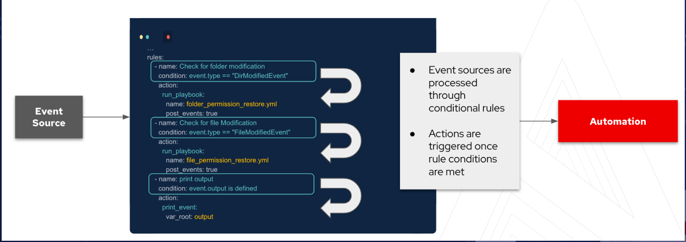
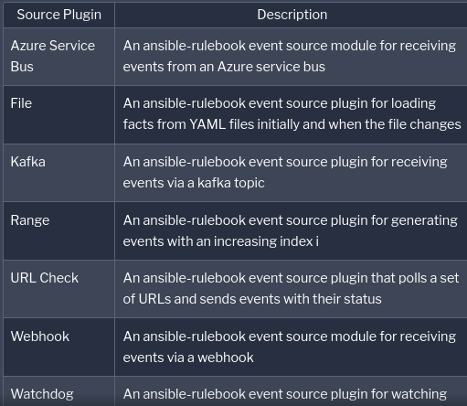

# ansible_eda_network_multivendor

Files for EDA Network Multivendor demo

## Getting started

The following links will explain how to install EDA and the other components used in the demo.

Optional Event-Driven CLI Ansible install:
Please note this code is the developer tech preview.
https://github.com/ansible/event-driven-ansible

EDA Controller GUI is part of a normal AAP install.
Try AAP for free: https://www.redhat.com/en/technologies/management/ansible/try-it
Developer License: https://developers.redhat.com/products/ansible/overview

Telegraf Collector Install
https://docs.influxdata.com/telegraf/v1.21/introduction/installation/
Please see this repo for my example telegraf.conf file.

Kafka Install
https://kafka.apache.org/quickstart

## Background for Event Driven Ansible
ansible-rulebook relies on a few components. These components all come together to allow you to respond to events and decide on the next course of action. The three main components to the rulebooks are as follows:

* Source - The sources of the events come from source plugins. These plugins define what    Event-Driven Ansible is listening to for events.
* Condition - The conditional statements in the rulebook allow us to match criteria on which one want to have some kind of response to.
* Action - Lastly, the action is the response once the condition has been met from the event source. This can be to trigger remediation, log a ticket for observation, or generate other events which would need responding to.

Currently, there are a number of source plugins however this list is being developed and as more partners get involved in the project the list will expand.

## Demo Rulebook
The rule book tells us that we are listening to a Kafka topic.

Source Plugin:
~~~
 sources:
    - ansible.eda.kafka:
        topic: telegraf
        host: ip-172-16-213-105.us-east-2.compute.internal
        port: 9092
        group_id:
~~~

The event we are looking for is a "Down" interface status coming from the Json in the event. Notably, we are using a list called protected ports to only act on specific ports that are down. We have two rules to evaulate GRPC or GNMI data payloads.

### Rules:
~~~
rules:
    - name: Retrieve Data from GRPC Dial-out and Launch Job-template
      condition: events.body.fields.new_state == "interface-notif-state-down" and events.body.fields.if_name in vars.protected
    - name: Retrieve Data from GNMI Dial-in and Launch Job-template
      condition: events.body.fields.oper_status == "DOWN" and events.body.tags.name in vars.protected
~~~
Lastly we have actions to launch a job-template to run the desired_port_state.yml playbook with specific data passed as extra-variables from firing the rulebook.

#### Actions
~~~
      action:
        run_job_template:
          name: "EDA-Protected-Ports"
          organization: "Default"
          job_args:
            extra_vars:
              interface: "{{ event.body.fields.if_name }}"
              rtr: "{{ event.body.fields.host_name }}"

      action:
        run_job_template:
          name: "EDA-Protected-Ports"
          organization: "Default"
          job_args:
            extra_vars:
              interface: "{{ event.body.tags.name }}"
              rtr: "{{ event.body.tags.source }}"
~~~

## Demo Playbook
When ansible-rulebook works with a playbook, the event data is available to the playbook with the use of ansible_eda.event. Now, let's exit the current rulebook and lets take a look at the playbook desired_port_state.yml

The extra-variables from the rulebook action define `rtr`. Also note that the job-template used to manage this playbook requires prompt for extra-variables to be checked.
~~~
---
- name: Triage Down Interfaces
  hosts: "{{ rtr }}"
  gather_facts: False
  tasks:
   
    - name: Grab Current Time
      set_fact: current_time="{{ lookup('pipe','date +%Y-%m-%d\ %H:%M:%S') }}"
~~~ 

#### Netcommon     
The ansible.netcommon.network_resources module selects the appropriate interfaces resource module based on the os_name provided from the inventory group_vars. In other words this task is multi-vendor. Thie ansible.netcommon.cli_command module is simular but implicitly searches the ansible_network_os to run common CLI commands.
~~~
    - name: Attempt a No shut for {{ inventory_hostname }} {{ interface }}
      ansible.netcommon.network_resource:
        os_name: "{{ ansible_network_os }}"
        name: interfaces
        config:
          - name: "{{ interface }}"
            enabled: True
        state: merged

    - name: Check Interface State for {{ inventory_hostname }} {{ interface }}
      ansible.netcommon.cli_command:
        command: show ip interface {{ interface }}
      register: int_state

    - name: Print Event Info
      ansible.builtin.debug:
        var: int_state.stdout_lines
~~~

#### Assert
Below we run an assertion in a Block to allow for a rescue condition. If the interface is in a line protocol down state further action (open an incident) is required. The Service Now task will pass all triaged data collected above as part of the description for the netwrk operator to review.  
~~~
    - name: Assert that {{ inventory_hostname }} {{ interface }} is UP
      block:
        - ansible.builtin.assert:
            that:
              - "'line protocol is up' in int_state['stdout']"
            fail_msg: "{{ inventory_hostname }} {{ interface }} line protocol is down"
            success_msg: "{{ inventory_hostname }} {{ interface }} line protocol is up"
      rescue:
        - name: Collect running config for {{ inventory_hostname }} {{ interface }}
          ansible.netcommon.cli_command:
            command: show run interface {{ interface }}
          register: running

        - name: Create SNOW ticket for {{ inventory_hostname }} {{ interface }}
          servicenow.itsm.incident:
            instance:
              host: "{{ SN_HOST }}"
              username: "{{ SN_USERNAME }}"
              password: "{{ SN_PASSWORD }}"
            state: new
            impact: high
            urgency: high
            caller: admin
            description: "{{inventory_hostname}} ######## {{ int_state.stdout_lines }} ######## Running Config {{ running.stdout_lines }}"
            short_description: "{{inventory_hostname}} {{ interface }} @time {{ current_time }} is line protocol down"
          register: snow_var
          delegate_to: localhost

        - name: Show incident number
          ansible.builtin.debug:
            msg:
              - "{{ SN_HOST }}"
              - "{{ snow_var.record.number }}"
          delegate_to: localhost
~~~

