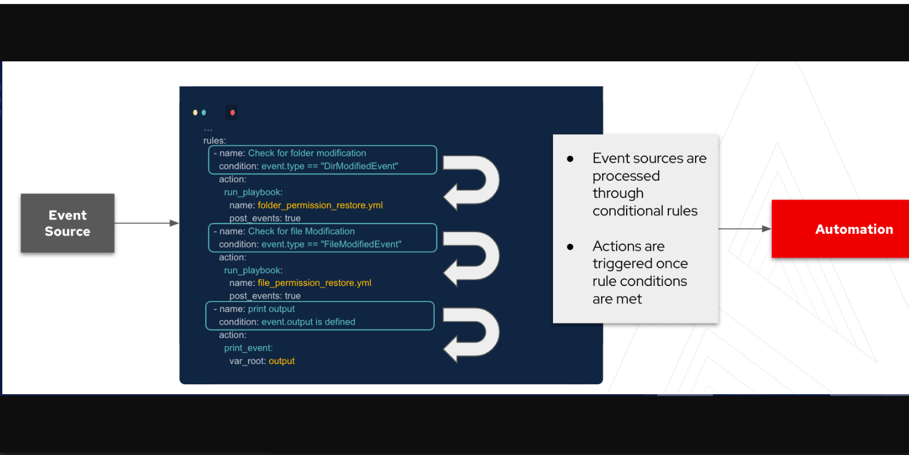

# ansible_eda_network_multivendor

Files for EDA Network Multivendor demo

## Getting started

The following links will explain how to install EDA and the other components used in the demo.

Optional Event-Driven CLI Ansible install:
Please note this code is the developer tech preview.
https://github.com/ansible/event-driven-ansible

EDA Controller GUI is part of a normal AAP install

Telegraf Collector Install
https://docs.influxdata.com/telegraf/v1.21/introduction/installation/
Please see this repo for my example telegraf.conf file.

Kafka Install
https://kafka.apache.org/quickstart

## Background for Event Driven Ansible
ansible-rulebook relies on a few components. These components all come together to allow you to respond to events and decide on the next course of action. The three main components to the rulebooks are as follows:

* Source - The sources of the events come from source plugins. These plugins define what    Event-Driven Ansible is listening to for events.
* Condition - The conditional statements in the rulebook allow us to match criteria on which one want to have some kind of response to.
* Action - Lastly, the action is the response once the condition has been met from the event source. This can be to trigger remediation, log a ticket for observation, or generate other events which would need responding to.

Currently, there are a number of source plugins however this list is being developed and as more partners get involved in the project the list will expand.

